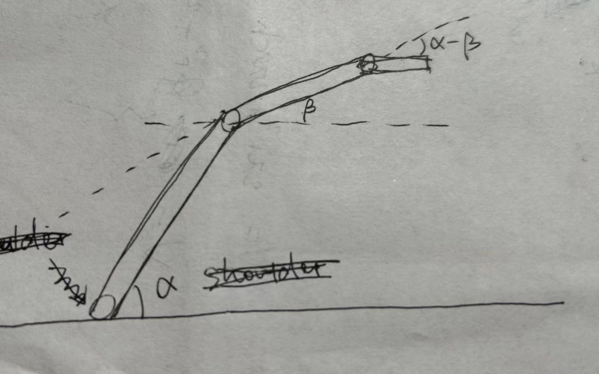

# Engineer_Invitation_Competition工程邀请赛
HKUSTGZ-HKUST 2024, HKUSTGZ部分

文件结构
```
Engineer_Invitation_Competition/
│
├── README.md
├── images/
|
├── SAND_TOWER/
│   ├── RoArm-M2-S_Example/	#机械臂底层代码
|	|	|——RoArm-M2_Module.h#主要改动这里
|	|
│   |── RoArm-M2-S_Python/	#网页指令式驱动代码（没用）
│   ├── espnowRecv3/		#机械手（末端关节）驱动代码
│   |── remote5/			#遥控器代码
│   ├── sandArmControl/		#底盘代码
│
├── FLAG/
│   ├── FlagArmControl/	#底盘代码
│   |── arm_control/	#机械爪代码

```
**SAND_TOWER部分代码内有较为详细的注释。**


# 实现技术细节
# 底盘

● 履带底盘，无线遥控（PS2手柄），stm32f407，速度2m/s,买两个

● 方案成熟，有很多例程

● 参数如下：


链接：[chassis](https://detail.tmall.com/item.htm?abbucket=14&id=743581875825&ns=1&spm=a21n57.1.0.0.4041523cM5mlwX)


---

# 机械臂

## 改装思路

- 需要五轴机械臂，需要在末端新增一个自由度进行改装
    - 新增舵机，一个esp32单独控制，使其**始终保持水平**
    - 末端手爪与其他自由度保持原状，减少改装难度


- 爪子


---

编辑于24.1.18 0:09 **根本不需要传感器这么麻烦！**





如图，让腕部始终保持水平只是一个简单的几何题，通过shoulder轴和elbow轴的相对位置解算即可。

可能存在的问题：发送信息的频率，决定机械臂运作的速度。如果跟不上，就用既定轨迹。

## 控制方式

**手柄按键按下按钮→传输json格式指令到电脑终端→终端采用http通信方式通知机械臂运动**


- **手柄&F407板通信**
    - app.c中修改ps2控制底盘代码，使按下右手边按键发生中断
    - 设置4个变量，用于存储舵机旋转角度
    - 按键一直按下时，加或减变量值
    - 解析成json格式指令
- **407板与ESP32通信**
    - F407板USART4串口空闲，开启中断
    - 通过蓝牙发送上一步解析出的json指令给ESP32
- **ESP32&机械臂通信**
    - [https://www.waveshare.net/wiki/RoArm-M2-S_JSON指令含义](https://www.waveshare.net/wiki/RoArm-M2-S_JSON%E6%8C%87%E4%BB%A4%E5%90%AB%E4%B9%89)
    - 采用http通信方式，配置机械臂 WIFI 模式处于 STA 模式，连接PC
    - 发送指令：json格式，参考[https://www.waveshare.net/wiki/RoArm-M2-S_JSON指令含义](https://www.waveshare.net/wiki/RoArm-M2-S_JSON%E6%8C%87%E4%BB%A4%E5%90%AB%E4%B9%89)
- **步骤复制与重现（方案1.0版本）**
    - [https://www.waveshare.net/wiki/RoArm-M2-S_步骤录制和重现](https://www.waveshare.net/wiki/RoArm-M2-S_%E6%AD%A5%E9%AA%A4%E5%BD%95%E5%88%B6%E5%92%8C%E9%87%8D%E7%8E%B0)
    - 录两段既定轨迹到两个文件中（接收旗帜，放下旗帜）
    - 记得加延时（最小值未知）


*控制方式说明简图*

**感悟：善用gpt！！！**

---
### update
**发现esp32控制板上的串口和i2c全被用完啦！！！！（发出尖锐的爆鸣声）**

**于是只好用esp-now通信方式，参考如下：**
- [Arduino for ESP32-----ESP-NOW介绍及使用](https://www.waveshare.net/wiki/RoArm-M2-S_%E6%AD%A5%E9%AA%A4%E5%BD%95%E5%88%B6%E5%92%8C%E9%87%8D%E7%8E%B0)

主要就是把几个init和回调函数补全一下。esp-now之间的信息通过结构体相互传递。

---

# 旗帜区机械臂

## 概述

采用42步进电机控制，只需要完成旗帜交接，机械臂无需太多自由度。


配合机械爪。主控板与机械臂控制板通过串口通讯，控制42步进电机；主控板直接控制机械爪。

### 42步进电机升降控制

- 数据通讯

所有的控制均使用PS2手柄完成。主控板与PS2手柄使用IIC通讯，主控板与机械臂控制版使用串口通讯。机械爪未到，暂定。

串口传输的每条数据包括三位：

1. 包头：0xAA，用于识别数据的开始。
2. 第二位识别是否启动电机，0x01代表开启电机，0x00代表电机休息。
3. 第三位识别转动方向，0x00和0x01。
- 主控板

主控板即底盘配套的开发板，使用UART4与机械臂控制板通讯。底盘的配到资料中已经有成熟的控制代码。用户的入口函数写在文件app.c中。添加的机械臂控制方面的代码具体如下：

```c
void arm_control (char msg)
{
	switch(msg) 
	{
		/*
			case 'l': 
			{ //正方形
				HAL_UART_Transmit_IT(&huart4, up_message, 3);
				break;
			}
			case 'p': 
			{ //圆
				HAL_UART_Transmit_IT(&huart4, down_message, 3);
				break;
			}
			*/
			case 'N': 
			{ //右摇杆 下
				HAL_UART_Transmit_IT(&huart4, up_message, 3);
				break;
			}
			case 'J': 
			{ //右摇杆 上
				HAL_UART_Transmit_IT(&huart4, down_message, 3);
				break;
			}
			case 'R':
			{//右摇杆 中
				HAL_UART_Transmit_IT(&huart4, default_message, 3);
				break;
			}
			default:
			{
				HAL_UART_Transmit_IT(&huart4, default_message, 3);
				break;
			}
							
	}
}
```

- 电机驱动器

步进电机采用PWM控制，需要通过专门的驱动器控制。驱动器采用4细分，1.5A电流，共阴接法。驱动器使用TB6600S。

- 机械臂控制板

由于主控板上的计时器全部被占用，故此使用另一块F407VGT6的开发板控制。机械臂控制板打开USART1和TIM2_CH2。USART1接受主控板数据包，识别包头后解析第二位，选择开启或关闭计时器。开启计时器之后解析第三位数据，即决定转动方向。


```c
void HAL_UART_RxCpltCallback(UART_HandleTypeDef *huart)
{
	if (huart == &huart1)
	{
		HAL_UART_Transmit_DMA(&huart2, control_message, 3);
		if (control_message[0] == 0xAA)
		{
			if (control_message[1] == 0x01)
			{
				if (control_message[2] == 0x00) HAL_GPIO_WritePin(DIR_GPIO_Port, DIR_Pin, GPIO_PIN_RESET);
				else if (control_message[2] == 0x01) HAL_GPIO_WritePin(DIR_GPIO_Port, DIR_Pin, GPIO_PIN_SET);
				HAL_TIM_PWM_Start_IT(&htim2,TIM_CHANNEL_2);
			}
			else
			{
				HAL_TIM_PWM_Stop_IT(&htim2,TIM_CHANNEL_2);
			}
		}
		HAL_UART_Receive_DMA(huart, control_message, 3);
	}
}

```
---

## 机械爪

长这样：


总线舵机

